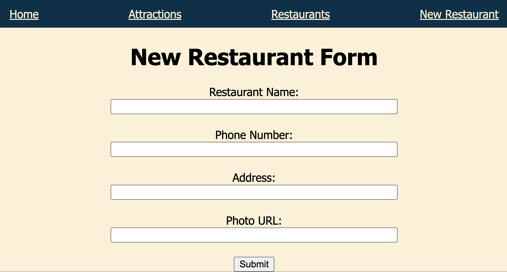
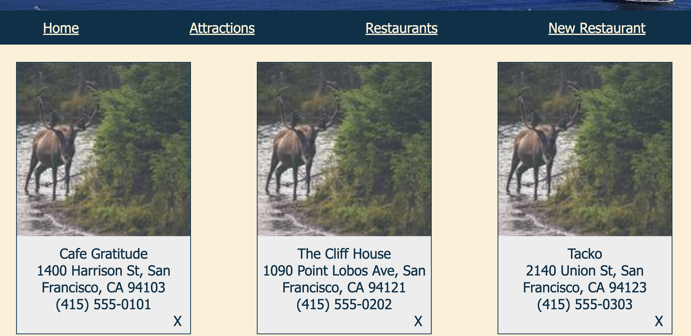

# CSC317-F24-P2: JavaScript

In this project, you will build on your website from Project 1 to make a dynamic frontend.

Goals for this assignment:
* create a dynamic frontend for a website
* get practice using the DOM to update HTML elements
* get practice using event handlers
* serve our website with node/express

## Section 1: Set up the project directory

For this project, we will be using `node` and express to serve our website. First, `cd` into the `server` directory provided. This will be the workspace for this project.

### Create the project

To create a new project, run:
```
npm init -y
```

### Install dependencies 

In `package.json`, add `type: "module"` since we're using ESModules for our project.

Install the  needed dependencies with:

```
npm install <package name>
```

We'll be using the packages `nodemon`, `express`, and `ejs`.

Installing them will add the modules to the `dependencies` portion of `package.json` and create a `node_modules` folder.

### Add scripts  

In `package.json`, under `scripts`, add a `start` script that runs `nodemon server.js`. 
```
...

    start: "nodemon server.js",

...
```

You should now be able to run the server with 

```
npm start
```


Open up `server.js` and inspect it. This is the entry point of your program. You should see that the server starts on port 3000. Visit `localhost:3000`. You should see a barebones website that says "Hello World".

### Migrate Project 1


Now, copy and paste your HTML from project 1 to the `public` folder. There is a placeholder HTML file for `index.html` pages inside `public` already. Include the attractions page as well. For the restaurants page, copy and paste it into `views/restaurants.ejs` instead. Serve up your files with `sendFile`.

Copy and paste your CSS from project 1 into the `styles.css` file. You can rename the CSS file if you'd like so that its name matches the name referenced in the HTML files.

Look at `server.js` and add routes for you attractions and restaurant pages so that they are served up at `localhost:3000/attractions` and `localhost:3000/restaurants`.

Your static website from project 1 is now running with `node` and `express`. You should be able to see it rendered at `localhost:3000`. Nice!

Click around the links to make sure everything's working. You might have to update the nav links to point at `/`, `attractions`, and `restaurants` (instead of `attractions.html` etc). 

## Section 2: Shared Headers

In this section, we'll render your existing header, footer, and nav bar through the DOM. The result should look the same, but you'll have some cleaner looking HTML and some re-usable js code that populates these elements in case you want to add a new page later.

In the `public/scripts/header.js` file, populate the header, nav, and footer elements of one of your pages by interfacing with the DOM.

At the end of this section, all of your HTML pages should reference `header.js`, and render the header, nav, and footer using the DOM in `header.js`. The HTML for those elements should look pretty bare now:

```
    <header></header>
    <nav></nav>
    <footer></footer>
```

Now, creating a new page using the same header, nav, and footer layout is no sweat, just use `header.js`!

## Section 3: New Restaurant Form

In this section, we'll create a form to add a new restuarant entry to our restaurants page.

Add a new page that just displays a form to the top of the page that asks for the user's input for a restaurant's information including name, phone number, an address, and an optional field for photo url. Reuse the code you put together in `header.js` for this.  Don't forget to update `server.js` and the navigation bar to include the new link and serve it up from our express server.



Don't add any additional JS to this for now. We'll follow up more on getting this form to work properly in Project 3 when we properly hook up the backend.

## Section 4: Restaurant Data

In this section, we'll render the existing restaurant cards dynamically by importing the data into `server.js`, and rendering the frontend as a template. The result will look exactly the same, except the restaurant data will no longer be hardcoded in HTML.

Take a look at `data/restaurants.js`, and add your restaurant entries to that list. Each entry should contain the following values:

```
    {
        "name": "My Restaurant",
        "phone": "(415) 555-5555",
        "address": "1600 Holloway Ave, San Francisco, CA 94132",
        "photo": "https://picsum.photos/150/150" OR "/images/photo.png",
    },
    
```

Now import `restaurantData`  from `data/restaurants.js` in your `server.js` and change your harcoded cards in HTML to be rendered with EJS using the imported data. Instead of many cards entries, you should only have to write one template and use it to render every card. Make sure this page is served as a view with `render` instead of `sendFile`, using the values from `restaurantData`.


## Section 5: Delete Button

In this section, we'll add a delete button to the restaurant cards so they can be removed.

Add a delete button to the restaurant card. I used an X, but any symbol that suggests deletion is fine. In `scripts/restaurantCards.js`, use the DOM to implement the function `deleteRestaurantCard`, which deletes a card from the DOM. Attach the handler to each of the cards' buttons so that when the button is clicked, the DOM removes that card from the screen.

You should now be able to delete cards.

Refreshing the page or restarting the server will reset the cards shown to the values set in `restaurantData` from your server, and that's fine.  We will add persisting new cards between refreshes and restarts in a future project.



### On placeholder photos
You're welcome to use the [Lorem Picsum](https://picsum.photos/) website if you want to use stock photos -- it will even generate a random one for you. Usage is described on their website.

Simply point the `img` element's `src` attribute at the desired URL. Note that you can request photos of specific width and height.

# Rubric

Total Points: 40

Bonus Points: 5

|Project Setup and Migration| |
|---|---|
|Correct setup of Node.js project with necessary dependencies and start script configured|	5
|Successful migration of Project 1 HTML and CSS|	6

|Shared Headers Implementation | |
|---|---|
|Correct implementation of header.js to populate header, nav, and footer	| 6
|Proper integration of header.js across all HTML pages	| 3

|Dynamic Restaurant Data Rendering ||
|---|---|
|	Correct implementation of EJS template for dynamic card creation|	5
|	Proper set up of server side serving the template |	5

|New Restaurant Form	||
|---|---|
|Correct implementation of the form for adding new restaurants (non-functioning)|	2.5
|	Proper addition of a new page for the form |	2.5

|Delete Button Functionality	||
|---|---|
|Correct implementation of delete buttons on restaurant cards|	2.5
|	Proper functionality of delete buttons to remove cards|	2.5

Bonus:
|Overall Code Quality and Best Practices	||
|---|---|
|Clean, well-organized, and commented code	| 2.5
|Proper use of DOM manipulation and event handling	| 2.5